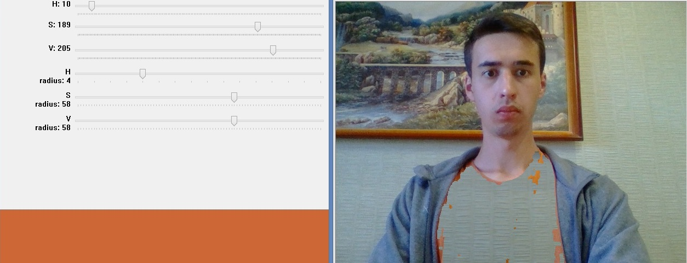

# Adaptive Camouflage Pro G63 Note Max Super Incredible X5M 3.5 JZ Turbo S+

Данный проект создан исключительно в развлекательных целях.
Содержимое не пытается оскорбить кого-либо или задеть 
чьи-либо чувства. Также данный материал не несет в себе никакой
смысловой или интелектуальной нагрузки.

## Демонстарция работы

## Использование

Для начала работы необходимо запустить файл 
`world_color_changer.py`, после чего на экране появится
следующий интерфейс:

С помощью ползунков на левом изображении необходимо подобрать
целевой цвет (в формате HSV), который необходимо будет изменить.

Поддерживаются несколько режимов замены:

* **0** - не производить замену
* **1** - замена белым шумом
* **2** - текстура номер один
* **3** - текстура номер два
* **4** - замена фоновым изображением, которое записывается
автоматически при запуске программы
* **i** - инверсия цветовой маски

Переключение между режимами осуществляется с помощью 
нажатия соответствующих клавиш на клавиатуре.
